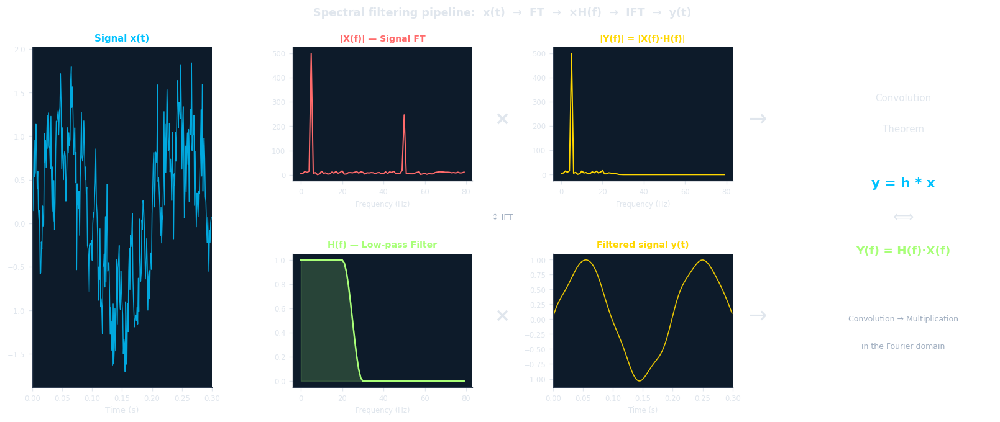
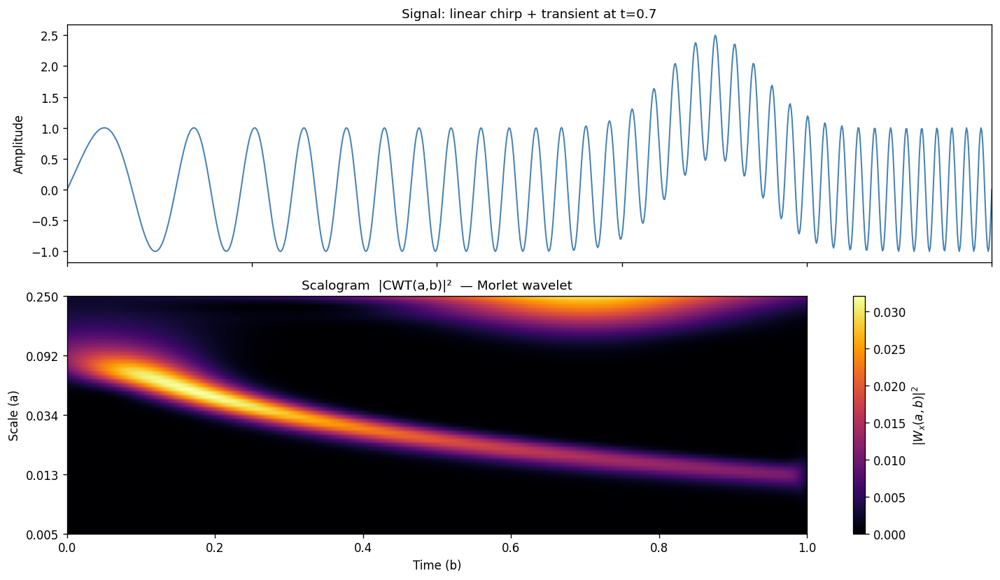
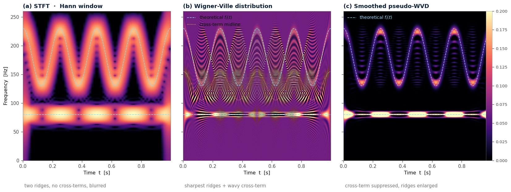
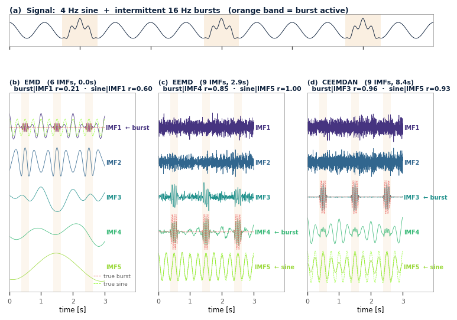
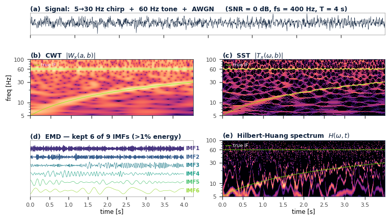
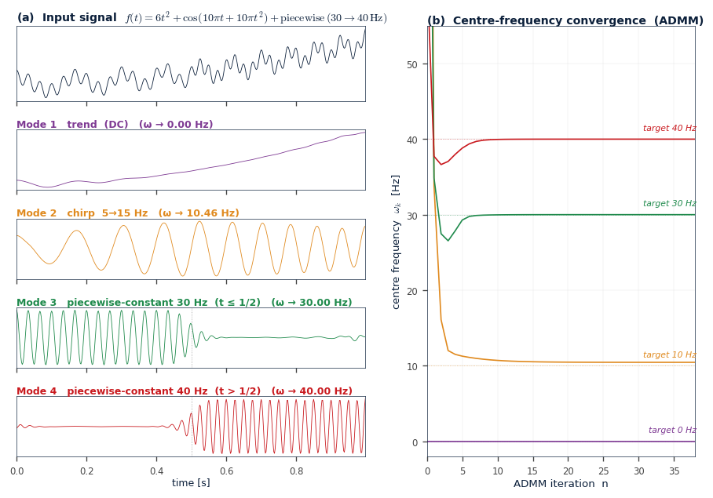
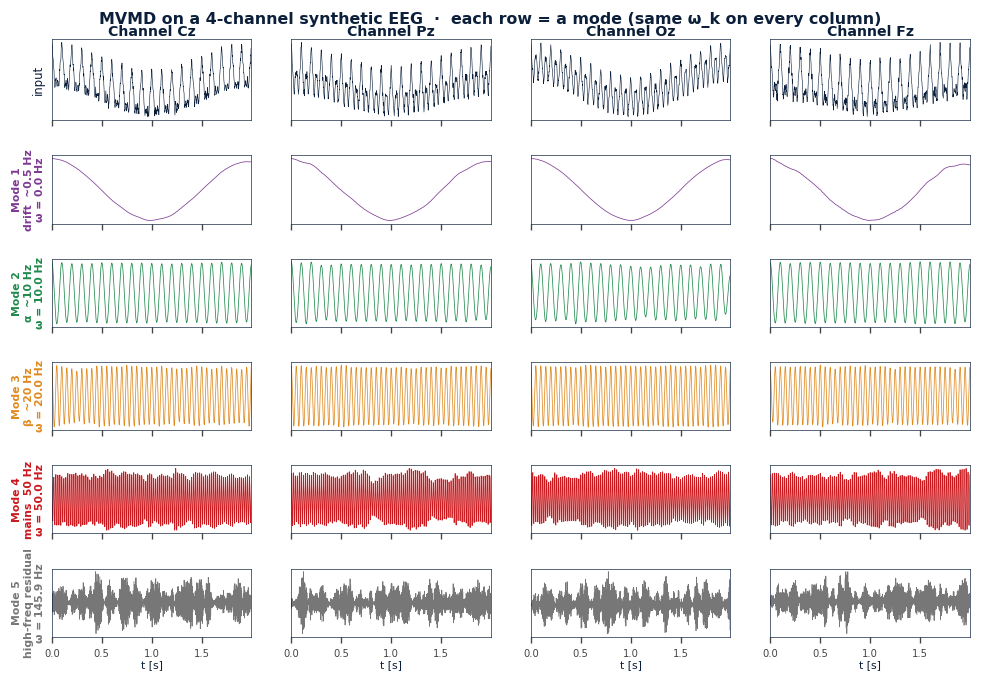
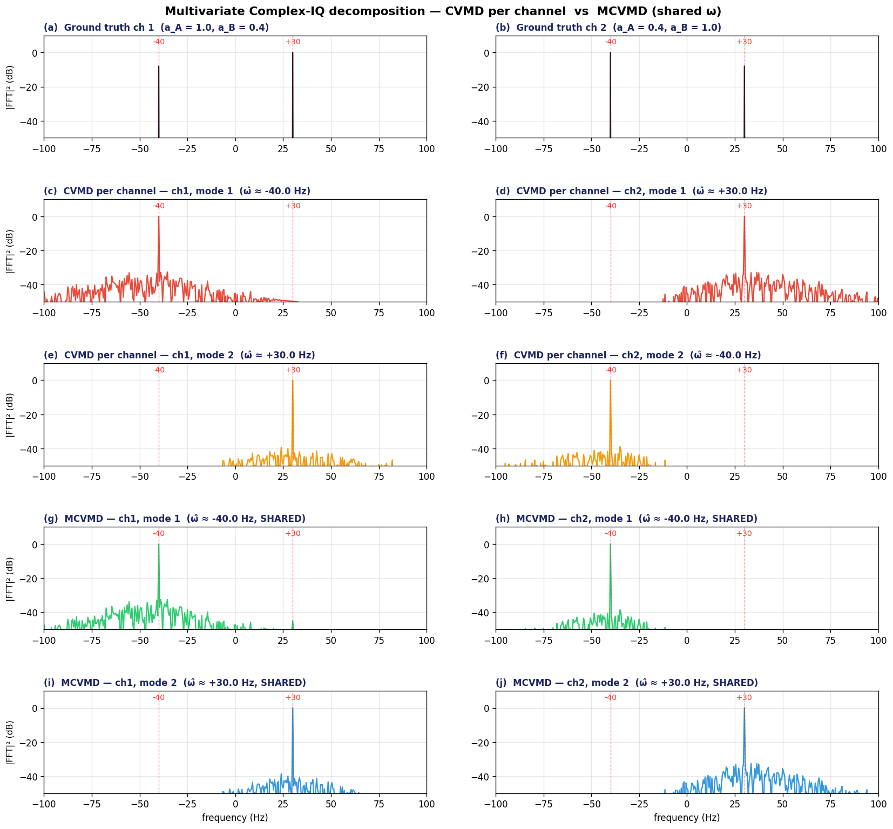

Example gallery — reference
============================

Annotated index of every demo in ``examples/``. Each module section opens
with a sample figure produced by the script highlighted in **bold** in
that module's table. Source files are on GitHub at
`philouc/inria_academy/tree/main/examples
<https://github.com/philouc/inria_academy/tree/main/examples>`_.

Helper modules live in the importable package :mod:`inria_academy.utils` and
are documented separately under :doc:`api/index`.

.. note::

   The images embedded below are static snapshots committed to the repo
   under :file:`docs/sphinx/_static/gallery/`. To regenerate them after
   changing a script, re-run the script with ``MPLBACKEND=Agg`` and save
   the figure into that directory. A future enhancement will switch this
   page over to `sphinx-gallery
   <https://sphinx-gallery.github.io/>`_ for automatic generation —
   the configuration is already wired into ``conf.py`` in dormant form.

----

Module 1 — Reminder: Fourier
----------------------------

   ``spectral_filtering_demo.py`` — the spectral filtering pipeline
   visualised end-to-end on a 5 Hz + 50 Hz signal with Gaussian noise
   and an ideal low-pass filter.

.. list-table::
   :header-rows: 1
   :widths: 35 65

   * - Script
     - Topic
   * - **spectral_filtering_demo.py**
     - Spectral filtering — the ``x(t) → FT → ×H(f) → IFT → y(t)`` pipeline,
       illustrated on a 5 Hz + 50 Hz signal with Gaussian noise and an
       ideal low-pass filter.

Module 2 — Reminder: Wavelets
-----------------------------

   ``03.benchmark_CWT_vs_Fourier_STFTGabor.py`` — Morlet scalogram of a
   linear chirp with a transient burst at ``t = 0.7 s``. The script also
   produces the Fourier-domain and STFT/Gabor companion views (see
   :file:`_static/gallery/module2_cwt_vs_fourier_fig02.png` and
   :file:`module2_cwt_vs_fourier_fig03.png`).

From mother wavelets and bases to long-memory processes and denoising.

.. list-table::
   :header-rows: 1
   :widths: 40 60

   * - Script
     - Topic
   * - ``00.morlet_params.py``
     - Morlet wavelet — effect of the bandwidth and centre frequency parameters.
   * - ``01.wavelet_bases.py``
     - Mother wavelets and basis functions (Haar, Daubechies, Symlets, Coiflets).
   * - ``01.wavelet_mexican_hat.py``
     - Exercise solutions for script 1 — Mexican hat focus.
   * - ``02.time_frequency_tiling.py``
     - Time-frequency tiling and the Heisenberg uncertainty principle.
   * - ``02.time_frequency_tiling_exercise.py``
     - Exercise solutions for script 2.
   * - **03.benchmark_CWT_vs_Fourier_STFTGabor.py**
     - Benchmark: CWT vs Fourier vs short-time Fourier (Gabor).
   * - ``04.long_memory.py``
     - Long-memory processes and Hurst exponent estimation.
   * - ``04.long_memory_sym4.py``
     - Same, using the Symlet 4 wavelet.
   * - ``04.long_memory_exercises.py``
     - Exercises 2 & 3 (sym4 version).
   * - ``05.wavelet_denoising.py``
     - Wavelet denoising — soft/hard thresholding with Symlet 4.
   * - ``05.wavelet_denoising_exercise.py``
     - Denoising exercises (Symlet 4).

Module 3 — STFT, WVD, SPWVD
---------------------------

   ``03.amfm_tf_comparison.py`` — head-to-head time-frequency representations
   on an AM-FM benchmark (FM deviation ±50 Hz around 180 Hz). The SPWVD
   resolves both the AM modulation and the FM frequency excursion without
   the WVD's cross-terms.

Quadratic time-frequency representations and their resolution trade-offs.

.. list-table::
   :header-rows: 1
   :widths: 40 60

   * - Script
     - Topic
   * - ``01.stft_vs_wvd_chirp.py``
     - STFT vs Wigner-Ville distribution on a linear chirp.
   * - ``02.wvd_cross_terms.py``
     - Multi-component WVD cross-terms — two parallel chirps.
   * - **03.amfm_tf_comparison.py**
     - AM-FM benchmark — STFT vs WVD vs SPWVD.

Module 4 — EMD, EEMD, CEEMDAN
-----------------------------

   ``05.scenario4_mode_mixing.py`` — the canonical Wu & Huang test signal
   (4 Hz sine + intermittent 16 Hz burst, ratio 4:1). EMD suffers from
   severe mode mixing; EEMD and CEEMDAN recover the two components into
   distinct IMFs.

Empirical Mode Decomposition and its noise-assisted variants.

.. list-table::
   :header-rows: 1
   :widths: 40 60

   * - Script
     - Topic
   * - ``01.emd_sifting_inaction.py``
     - The sifting algorithm step by step on the AM-FM benchmark.
   * - ``02.emd_hht_closing.py``
     - EMD + Hilbert-Huang Transform, closing the loop on the AM-FM benchmark.
   * - ``03.spwvd_vs_hht.py``
     - SPWVD vs HHT — side-by-side comparison on the AM-FM benchmark.
   * - ``04.emd_successful_decomposition.py``
     - EMD in practice — a successful decomposition example.
   * - **05.scenario4_mode_mixing.py**
     - EMD vs EEMD vs CEEMDAN on the canonical Wu & Huang mode-mixing test.

Module 5 — SWT / SST
--------------------

   ``04.scenario3_chirp_tone_noise.py`` — 5-panel comparison on a noisy
   chirp + 60 Hz tone (AWGN at 0 dB SNR). SST sharpens the time-frequency
   ridges relative to the raw CWT; EMD-HHT recovers the dominant components
   despite the noise.

Synchrosqueezing wavelet transform, benchmarked against EMD-HHT.

.. list-table::
   :header-rows: 1
   :widths: 40 60

   * - Script
     - Topic
   * - ``01.scenario1_chirp_tone.py``
     - Scenario 1 — chirp + tone, noiseless.
   * - ``02.scenario2_close_frequencies.py``
     - Scenario 2 — two close frequencies.
   * - ``03.scenario2b_four_methods.py``
     - Close frequencies — SST vs the full EMD family.
   * - **04.scenario3_chirp_tone_noise.py**
     - Scenario 3 — chirp + tone in noise.
   * - ``05.scenario3b_eemd_ceemdan.py``
     - Scenario 3b — noise-robust EMD variants under SST comparison.

Module 6 — VMD
--------------

   ``04.vmd_ex4_synthetic.py`` — VMD reproduces Dragomiretskiy & Zosso
   (2014, Fig. 8) by recovering 4 modes at 0, 10.5, 30 and 40 Hz on a
   synthetic test signal.

Variational Mode Decomposition (Dragomiretskiy & Zosso 2014).

.. list-table::
   :header-rows: 1
   :widths: 40 60

   * - Script
     - Topic
   * - ``00.vmd_def2_bw_examples.py``
     - Bandwidth definition illustrated (Dragomiretskiy & Zosso 2014, Fig. 2).
   * - ``01.vmd_ex1_tone_detection.py``
     - Example 1 — pure tone detection across the spectrum.
   * - ``02.scenario2c_vmd_close_freq.py``
     - Close frequencies — SST + EMD family + VMD (resolved).
   * - ``03.vmd_ex3_noisy_triharmonic.py``
     - Example 3 — noise robustness on a tri-harmonic.
   * - **04.vmd_ex4_synthetic.py**
     - Example 4 — synthetic signal (Dragomiretskiy & Zosso 2014, Fig. 8).
   * - ``04.vmd_ex4b_compare_classical.py``
     - Example 4 continued — classical methods on the same signal.
   * - ``05.vmd_ex5_ecg.py``
     - Example 5 — real-world ECG decomposition.

Module 7 — MVMD
---------------

   ``04.mvmd_ex4_alpha_eeg.py`` — MVMD on a 4-channel synthetic EEG
   (Cz, Pz, Oz, Fz). Each row is one mode with a shared centre frequency
   ω\ :sub:`k` across channels: drift (≈0 Hz), α (≈10 Hz), β (≈20 Hz),
   mains (50 Hz) and high-frequency residual.

Multivariate VMD on multichannel signals (ur Rehman & Aftab 2019).

.. list-table::
   :header-rows: 1
   :widths: 40 60

   * - Script
     - Topic
   * - ``01.mvmd_ex1_alignment.py``
     - Example 1 — mode alignment across channels.
   * - ``02.mvmd_ex2_filterbank.py``
     - Example 2 — filterbank behaviour on white Gaussian noise.
   * - ``03.mvmd_ex3_orthogonality.py``
     - Example 3 — quasi-orthogonality of recovered modes.
   * - **04.mvmd_ex4_alpha_eeg.py**
     - Example 4 — α rhythms in 4-channel EEG.
   * - ``05.mvmd_ex5_ctg.py``
     - Example 5 — cardiotocography (FHR + UC).

Module 8 — Complex EMD / VMD
----------------------------

   ``radar_iq_multivariate_benchmark.py`` — 2-channel IQ radar with
   asymmetric target amplitudes. **CVMD per channel** orders modes by
   energy → mode indices swap across channels (mode 1 = +30 Hz on ch 1
   but −40 Hz on ch 2). **MCVMD** enforces a shared set of centre
   frequencies → mode k indexes the same physical target on every
   channel.

Complex-valued and analytic-signal extensions of EMD and VMD (Doppler /
IQ data). Two benchmark scripts, no numeric prefix.

.. list-table::
   :header-rows: 1
   :widths: 40 60

   * - Script
     - Topic
   * - ``radar_iq_benchmark.py``
     - Univariate complex-IQ benchmark — 4 strategies compared (naive
       real VMD, channel-wise VMD, BEMD, MCVMD) on a synthetic bilateral
       Doppler signal.
   * - **radar_iq_multivariate_benchmark.py**
     - Multivariate complex-IQ benchmark — CVMD per channel vs MCVMD on a
       2-channel asymmetric IQ scene.

----

References
----------

* Dragomiretskiy, K. & Zosso, D. (2014). *Variational Mode Decomposition.*
  IEEE Transactions on Signal Processing, 62(3), 531–544.
* ur Rehman, N. & Aftab, H. (2019). *Multivariate Variational Mode
  Decomposition.* IEEE Transactions on Signal Processing.
* Wu, Z. & Huang, N. E. (2009). *Ensemble Empirical Mode Decomposition: A
  Noise-Assisted Data Analysis Method.* Advances in Adaptive Data Analysis,
  1(1), 1–41.
* Daubechies, I., Lu, J. & Wu, H.-T. (2011). *Synchrosqueezed wavelet
  transforms: An empirical mode decomposition-like tool.* Applied and
  Computational Harmonic Analysis, 30(2), 243–261.
* Rilling, G., Flandrin, P., Gonçalves, P. & Lilly, J. M. (2007).
  *Bivariate Empirical Mode Decomposition.* IEEE Signal Processing
  Letters, 14(12), 936–939.
* Hu, X. et al. (2022). *Complex Variational Mode Decomposition.* IEEE
  Signal Processing Letters.
* Akaike, H. (1974). IEEE Trans. Aut. Control 19(6), 716–723.
* Schwarz, G. (1978). *Estimating the dimension of a model.* Annals of
  Statistics 6(2), 461–464.
* Bandt, C. & Pompe, B. (2002). *Permutation entropy: a natural complexity
  measure for time series.* Phys. Rev. Lett. 88(17), 174102.
* Satopaa, V. et al. (2011). *Finding a kneedle in a haystack.* ICDCSW.
